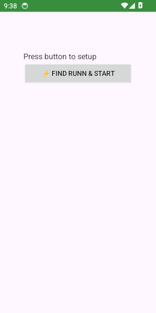
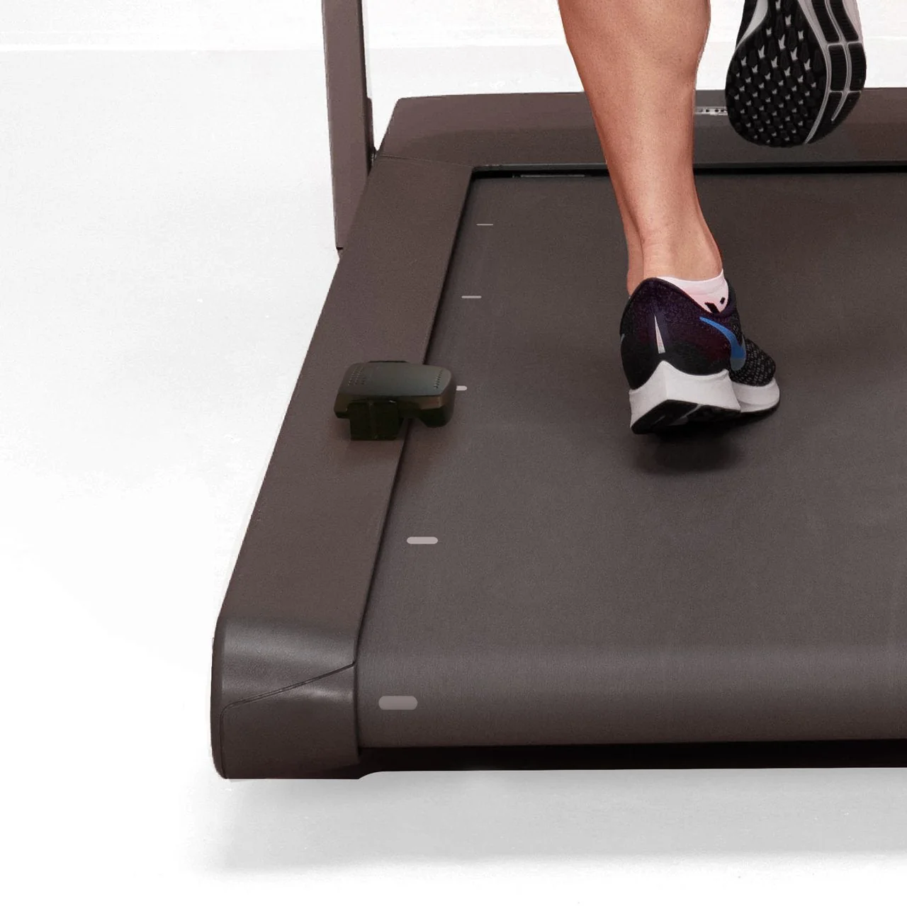

# ruNNNpe bridge

[](https://github.com/zappbrannigan34/ruNNNpe-bridge/actions/workflows/android-build.yml)
[](https://github.com/zappbrannigan34/ruNNNpe-bridge/releases/latest)
[](https://developer.android.com/)
[](https://developer.android.com/about/versions/android-10)
[](https://developer.android.com/google/play/requirements/target-sdk)
[](https://developer.android.com/health-and-fitness/guides/health-connect)

Android bridge between NPE RUNN and Google Health Connect.

## Table of contents

- [Features](#features)
- [Screenshots](#screenshots)
- [Download](#download)
- [Quick start](#quick-start)
- [Project docs](#project-docs)

## Features

- Background BLE monitoring with foreground service.
- Automatic workout start and finish detection.
- Automatic HR sensor discovery and reconnect.
- Live metrics in app and notification.
- Health Connect write: session, segment, speed, distance, steps, HR, calories, elevation.

## Screenshots

### ruNNNpe bridge app screen



### NPE RUNN device



## Download

- Latest release assets: [Releases](https://github.com/zappbrannigan34/ruNNNpe-bridge/releases/latest)
- Expected release assets: `ruNNNpe bridge-<tag>.apk` and `ruNNNpe bridge-<tag>.aab`

## Quick start

```bat
gradlew.bat assembleDebug
```

## Release build

```bash
./gradlew assembleRelease bundleRelease
```

After install:

1. Grant BLE, notifications, and Health Connect permissions.
2. Tap `Find RUNN & Start`.
3. Keep app unrestricted in battery settings for stable background work.

## Publication policy docs

- Privacy Policy: `PRIVACY_POLICY.md`
- Public URL for Play Console: `https://github.com/zappbrannigan34/ruNNNpe-bridge/blob/master/PRIVACY_POLICY.md`
- License: `LICENSE`

## Project docs

- Setup: `docs/SETUP.md`
- Publishing: `docs/PUBLISHING.md`
- Architecture: `docs/ARCHITECTURE.md`
- Dependencies: `docs/DEPENDENCIES.md`
- Troubleshooting: `docs/TROUBLESHOOTING.md`
- CI/CD: `docs/CI_CD.md`
- Release checklist: `RELEASE.md`
