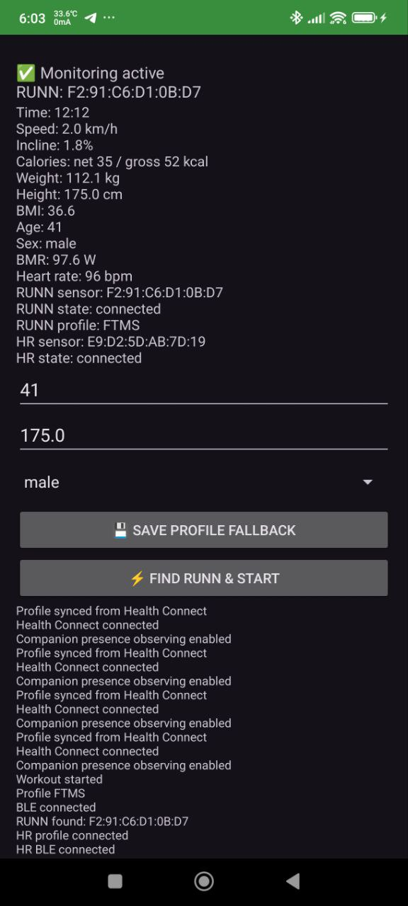

# ruNNNpe bridge

[](https://github.com/zappbrannigan34/ruNNNpe-bridge/actions/workflows/android-build.yml)
[](https://github.com/zappbrannigan34/ruNNNpe-bridge/releases/latest)
[](https://developer.android.com/)
[](https://developer.android.com/about/versions/android-10)
[](https://developer.android.com/google/play/requirements/target-sdk)
[](https://developer.android.com/health-and-fitness/guides/health-connect)

Android bridge between NPE RUNN and Google Health Connect.

`ruNNNpe bridge` is for treadmill runners who want their indoor workouts to be visible in Health Connect apps, even when the treadmill itself is not "smart" enough or does not sync well.

## Table of contents

- [Features](#features)
- [Why this app exists](#why-this-app-exists)
- [Why RUNN + ruNNNpe bridge](#why-runn--runnnpe-bridge)
- [Screenshots](#screenshots)
- [Download](#download)
- [Quick start](#quick-start)
- [Project docs](#project-docs)

## Why this app exists

- NPE RUNN is a retrofit treadmill sensor that adds BLE/ANT+ connectivity and broadcasts treadmill metrics (speed, incline, cadence).
- Many users still need a reliable Android path to move those treadmill metrics into Health Connect, especially for long workouts and downstream app sync.
- This app solves that gap: it reads RUNN telemetry, auto-detects workouts, and writes Health Connect records in a stable format that other apps can consume.

## Why RUNN + ruNNNpe bridge

- Better treadmill telemetry source: RUNN provides speed/incline/cadence from the treadmill side.
- Fully automatic workout flow after setup: no manual start/stop in the app for each session.
- Phone-stays-in-pocket workflow: background monitoring reconnects RUNN/HR and syncs data without opening the app every workout.
- Health Connect-first pipeline: your workout is written to HC with session + series data (speed, HR, steps, cadence, calories, elevation, floors).
- Reliable long-session export: writes are chunked to avoid Health Connect record-size failures.
- Practical treadmill fallbacks: missing steps can be estimated from distance/profile, and elevation is preserved as summary metrics.
- Background-ready behavior: automatic RUNN/HR reconnect and workout start/finish handling.

In practice, this is a set-and-forget setup: after initial pairing and permissions, you can focus on training instead of phone taps.

If you are searching for terms like `NPE RUNN Health Connect`, `Android treadmill to Health Connect`, `RUNN Google Fit sync`, or `RUNN Fitbit via Health Connect`, this is the project for that workflow.

## About NPE RUNN (official references)

- Product page: <https://npe.fit/products/runn>
- NPE overview page: <https://npe.fit/>
- NPE support (speed/incline calibration notes): <https://support.npe.fit/hc/en-us/articles/360037973792-Do-I-need-to-calibrate-my-Runn-speed-incline>

## Features

- Background BLE monitoring with foreground service.
- Automatic workout start and finish detection.
- Automatic HR sensor discovery and reconnect.
- Set-and-forget behavior: no per-workout app start/stop flow required after setup.
- Live metrics in app and notification.
- Health Connect write: session/segment, speed, distance, steps, steps cadence, HR, calories, elevation gained, floors climbed.
- Health Connect profile backfill: weight, height, BMR, and personal step-length inference from HC history.

## Screenshots

### ruNNNpe bridge app screen



### NPE RUNN device


## Download

- Latest release assets: [Releases](https://github.com/zappbrannigan34/ruNNNpe-bridge/releases/latest)
- Rolling pre-release assets: [pre-release](https://github.com/zappbrannigan34/ruNNNpe-bridge/releases/tag/pre-release)
- Expected release assets: `ruNNNpe bridge-<tag>.apk` and `ruNNNpe bridge-<tag>.aab`

## Quick start

```bat
gradlew.bat assembleDebug
```

## Release build

```bash
./gradlew assembleRelease bundleRelease
```

After install:

1. On first launch, app requests BLE, Health Connect (including route write), notifications, optional location anchor permission, and battery optimization exemption.
2. Tap `Find RUNN & Start`.
3. Keep app unrestricted in battery settings for stable background work.
4. After app updates, required permissions and Bluetooth state are re-checked automatically; missing permissions are requested again.

## Publication policy docs

- Privacy Policy: `PRIVACY_POLICY.md`
- Public URL for Play Console: `https://github.com/zappbrannigan34/ruNNNpe-bridge/blob/master/PRIVACY_POLICY.md`
- License: `LICENSE`

## Project docs

- Setup: `docs/SETUP.md`
- Publishing: `docs/PUBLISHING.md`
- Architecture: `docs/ARCHITECTURE.md`
- Health Connect coverage: `docs/HC_COVERAGE.md`
- Dependencies: `docs/DEPENDENCIES.md`
- Troubleshooting: `docs/TROUBLESHOOTING.md`
- CI/CD: `docs/CI_CD.md`
- Release checklist: `RELEASE.md`
