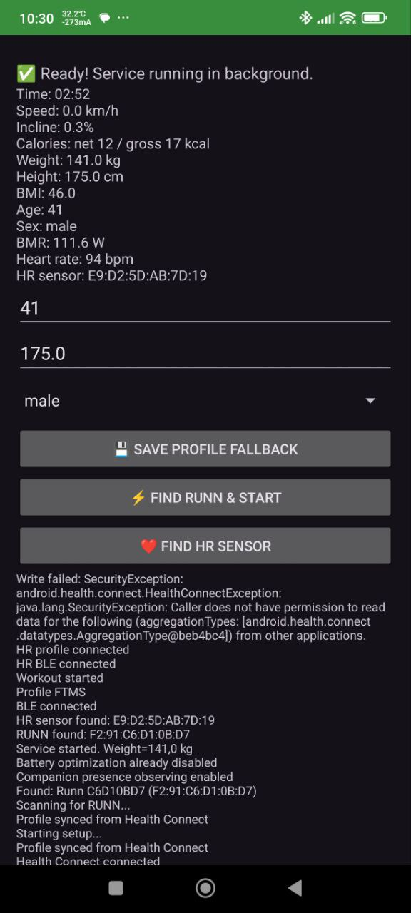
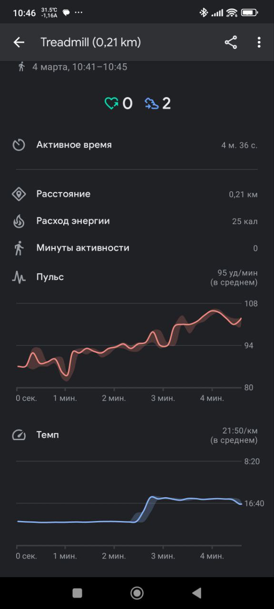

# ruNNNpe-bridge

[](https://github.com/zappbrannigan34/ruNNNpe-bridge/actions/workflows/android-build.yml)
[](https://github.com/zappbrannigan34/ruNNNpe-bridge/releases/latest)
[](https://developer.android.com/)
[](https://developer.android.com/about/versions/android-10)
[](https://developer.android.com/health-and-fitness/guides/health-connect)

Android bridge between NPE RUNN and Google Health Connect.

## Table of contents

- [Features](#features)
- [Screenshots](#screenshots)
- [Download](#download)
- [Quick start](#quick-start)
- [Project docs](#project-docs)
- [CI and release](#ci-and-release)

## Features

- Background BLE monitoring with foreground service.
- Automatic workout start and finish detection.
- Automatic HR sensor discovery and reconnect.
- Live metrics in app and notification.
- Health Connect write: session, segment, speed, distance, steps, HR, calories, elevation.

## Screenshots

### Application



### Device / workout view



## Download

- Latest APK: [Releases](https://github.com/zappbrannigan34/ruNNNpe-bridge/releases/latest)
- Release asset naming: `ruNNNpe-bridge-<tag>.apk`

## Quick start

```bat
gradlew.bat assembleDebug
```

After install:

1. Grant BLE, notifications, and Health Connect permissions.
2. Tap `Find RUNN & Start`.
3. Keep app unrestricted in battery settings for stable background work.

## Project docs

- Setup: `docs/SETUP.md`
- Architecture: `docs/ARCHITECTURE.md`
- Dependencies: `docs/DEPENDENCIES.md`
- Troubleshooting: `docs/TROUBLESHOOTING.md`
- CI/CD: `docs/CI_CD.md`
- Release checklist: `RELEASE.md`

## CI and release

- Build workflow: `.github/workflows/android-build.yml`
- Publish workflow: `.github/workflows/publish.yml`
- Tag-based release: push tag `v*` or run publish workflow manually.
